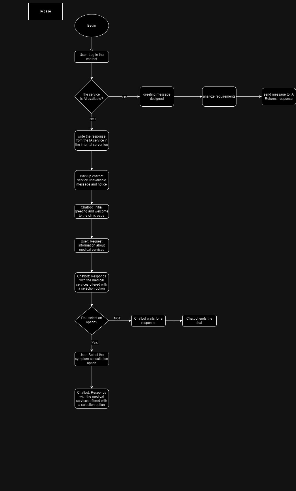

# IA CHATBOT

## CONTEXT
The company "Coomeva" needs a Chatbot that only users can use. This Chatbot, based on symptomatology, should recommend a specialization to consult and, based on the specialization, recommend one or more doctors to consult with based on AI.

### Functional Requirements 
**1.Registration in the web plataform (Auth step):**
Allow users to register with a username, email and password.

**2.make Login in the plataform (Auth step):**
Allow users to log in with  email and password.

**3.Sending and Receiving Messages:**
Allow users to send text messages to IA chatbot.
Users must be able to receive and view messages sent by IA chatbot.

**4.Basic message history:**
Provide a basic message history so users can view past conversations.

**5.Simple User Interface:**
Create a simple user interface that allows users to send and receive messages intuitively.

**6.Initial Platform:**
Develop the application initially on the web

**7.Consult advice on which doctor to consult:**
el usuario por medio del chat ia podra obtener concejo sobre que medico de la base de datos de medicos asociados a Coomeva.

**8.Consult which specialist to consult:**
based on your ailments, the AI should give you advice on which specialist from a medical branch to consult.

## Diagram C4

### Diagram C1

### Diagram C2

### Diagram C3

## cases use

## Flowchart

## roles
**Frontend Developer:** Andres F. Muñoz S  
**Backend Developer:** Camilo A. Velásquez V   
**Quality assurance:** todo el equipo  
**DevOps management:** Kenny A. Diaz C 

## Technologies
**Activity Manager:** Trello     
**Version controller:** Git     
**Integration driver:** jenkins, github     
**Cloud:** azure    
**FrontEnd:** react 
**BackEnd:** Spring Boot    

## Authors

-   [@Keni diaz](https://github.com/kennydiaz1)
-   [@Camilo Velasquez](https://www.github.com/zarrok2112)
-   [@Andres muños](https://github.com/Andressann)

