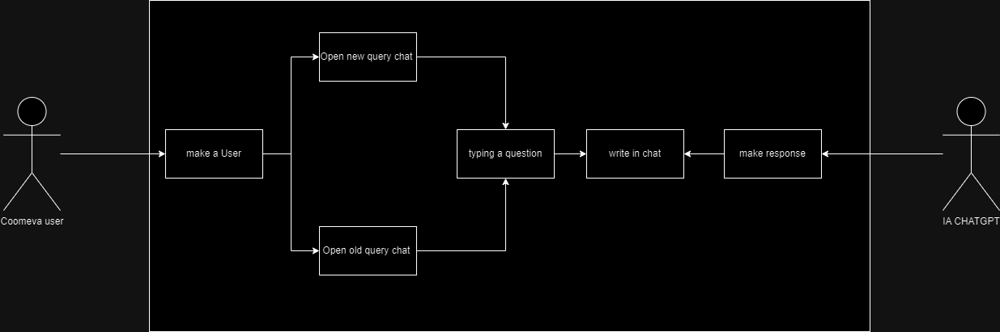

# CHATBOT IA

## CONTEXTO
La empresa “Coomeva” necesita un Chatbot que solo los usuarios puedan utilizar, este ChatBot basado en la sintomatología debe recomendar especialización a consultar y basado a la especialización recomendar un médico o médicos a los que pueda consultar en base de IA..

### Requisitos funcionales 
**1. Registro e Inicio de Sesión:**
Permitir a los usuarios registrarse con un nombre de usuario y contraseña.
Iniciar sesión utilizando las credenciales proporcionadas.

**2.Envío y Recepción de Mensajes:**
Permitir a los usuarios enviar mensajes de texto a otros usuarios registrados.
Los usuarios deben poder recibir y ver los mensajes enviados por otros usuarios.

**3.Notificaciones Básicas:**
Enviar notificaciones básicas a los usuarios cuando reciben un nuevo mensaje.

**4.Gestión Simple de Contactos:**
Permitir a los usuarios agregar y eliminar contactos básicos.
Mostrar una lista de contactos disponibles para enviar mensajes.

**5.Historial Básico de Mensajes:**
Proporcionar un historial básico de mensajes para que los usuarios puedan ver las conversaciones pasadas.

**6.Interfaz de Usuario Simple:**
Crear una interfaz de usuario simple que permita a los usuarios enviar y recibir mensajes de manera intuitiva.

**7.Plataforma Inicial:**
Desarrollar la aplicación inicialmente para una sola plataforma (por ejemplo, móvil o web).

**8.Funcionalidades Básicas:**
Limitar las funcionalidades a lo esencial: envío de mensajes de texto y gestión básica de contactos.

## Diagrama C4

### Diagrama C1

### Diagrama C2

### Diagrama C3

## Casos de uso 

## roles
**Frontend Developer:** Andres F. Muñoz S  
**Backend Developer:** Camilo A. Velásquez V   
**Quality assurance:** todo el equipo  
**DevOps management:** Kenny A. Diaz C 

## Tecnologías
**Administrador de actividades:** Trello   
**Controlador de versiones:** Git  
**Controlador de integración:** jenkins, github    
**Nube** azure     
**FrontEnd:** react    
**BackEnd:** Spring Boot    

## Authors

-   [@Keni diaz](https://github.com/kennydiaz1)
-   [@Camilo Velasquez](https://www.github.com/zarrok2112)
-   [@Andres muños](https://github.com/Andressann)

